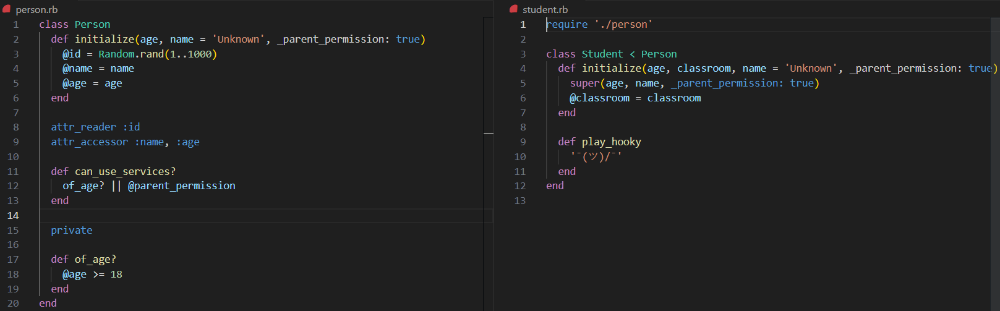

## School-libray-Ruby

<a name="readme-top"></a>
<div align="center">
    
  <br/>
  <h3><b>School-libray-Ruby</b></h3>
</div>
# 📗 Table of Contents

- [📗 Table of Contents](#-table-of-contents)
- [📖 School-libray-Ruby School-libray-Ruby](#-morse-code-ruby-morse-code-ruby)
  - [🛠 Built With ](#-built-with-)
    - [Tech Stack ](#tech-stack-)
    - [Key Features ](#key-features-)
  - [💻 Getting Started ](#-getting-started-)
    - [Prerequisites](#prerequisites)
    - [Setup](#setup)
    - [Install](#install)
    - [Usage](#usage)
    - [Run tests](#run-tests)
  - [👥 Authors ](#-authors-)
  - [🔭 Future Features ](#-future-features-)
  - [🤝 Contributing ](#-contributing-)
  - [🙏 Acknowledgements](#acknowledgements)
  - [📝 License ](#-license-)

# 📖 School-libray-Ruby <a name="about-project">School-libray-Ruby</a>

**School-libray-Ruby** is a lybrary management written in Ruby. Its primary goal is to tool to record what books are in the library and who borrows them.

Description:

Welcome to the OOP University Library Management System! As the librarian of OOP University, you have the important responsibility of keeping track of the books in the library and managing the borrowing records. To make your task easier and more efficient, we have created a powerful app built with Ruby that allows you to maintain a comprehensive record of all the books in the library and track who borrows them..

## 🛠 Built With <a name="built-with"></a>

### Tech Stack <a name="tech-stack"></a>

<details>
<summary>Backend</summary>
  <ul>
    <li><a href="https://www.postgresql.org/">Ruby</a></li>
  </ul>
</details>

### Key Features <a name="key-features"></a>

- **App in development: Person, Student, Teacher classes and decorators had been created**
- **Add new students or teachers.**
- **Add new books.**
- **Save records of who borrowed a given book and when.**
- **Preserve Data in JSON files**
- **Rspec Unit Test"

<p align="right">(<a href="#readme-top">back to top</a>)</p>


## 💻 Getting Started <a name="getting-started"></a>

To get a local copy up and running, follow these steps.

### Prerequisites

In order to run this project you need:

[Install Ruby](https://www.ruby-lang.org/en/documentation/installation/)

### Setup

```sh
  cd my-folder
  git clone git@github.com:smunoz1988/school-library.git
```

### Install

This project does not require additional dependencies, just Ruby interpreter. However, it uses RuboCop as a linter and you should set it up as well.

```sh
bundle install
```

### Usage

To run the project, navigate to the project directory and execute the following command:

```sh
  ruby Person.rb
```

### Run tests

To run tests, run the following command:

Run the following command
```sh
rubocop
```

## 👥 Authors <a name="authors"></a>

👤 **Santiago Munoz**

- GitHub: [@smunoz](https://github.com/smunoz1988)
- Twitter: [@twitterhandle](https://twitter.com/Santiag24209785)
- LinkedIn: [LinkedIn](https://www.linkedin.com/in/santiago-munoz-0b2b1a260)

👤 **Daniela Moreno**

- GitHub: [@daniela](https://github.com/danielamoreno699)
- LinkedIn: [LinkedIn](https://www.linkedin.com/in/daniela-moreno-06a139124/)
- twitter : [twitter](@Daniela38932450)


<p align="right">(<a href="#readme-top">back to top</a>)</p>

## 🔭 Future Features <a name="future-features"></a>

-**Delete books**

<p align="right">(<a href="#readme-top">back to top</a>)</p>

## 🤝 Contributing <a name="contributing"></a>

Contributions, issues, and feature requests are welcome!

<p align="right">(<a href="#readme-top">back to top</a>)</p>

## 🙏 Acknowledgments <a name="acknowledgements"></a>

I would like to thank my coding partners! the have been a great support!

<p align="right">(<a href="#readme-top">back to top</a>)</p>

## 📝 License <a name="license"></a>

This project is [MIT](./LICENSE) licensed.

<p align="right">(<a href="#readme-top">back to top</a>)</p>